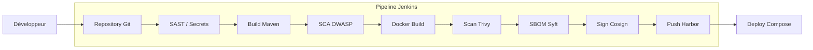

# FoodFrenzy — Secure Software Supply Chain
> **Projet DevSecOps : Pipeline CI/CD sécurisé avec Jenkins, Docker et Harbor.**

## Présentation du Projet
FoodFrenzy est une application Java/Spring Boot déployée via une chaîne de livraison logicielle ultra-sécurisée. Ce projet implémente les principes du **Security by Design** en automatisant les contrôles de sécurité à chaque étape du pipeline.

## Fonctionnalités de Sécurité
Le pipeline Jenkins ne se contente pas de déployer ; il protège l'application via :
- **SAST (Semgrep)** : Analyse statique du code source pour détecter les failles logiques.
- **Secret Scan (Gitleaks)** : Prévention de la fuite d'identifiants dans Git.
- **SCA (OWASP)** : Analyse des vulnérabilités dans les dépendances Maven.
- **Container Scan (Trivy)** : Détection des failles dans l'OS du conteneur.
- **Intégrité (Cosign)** : Signature cryptographique des images pour garantir leur origine.
- **Transparence (Syft)** : Génération automatique d'un SBOM (Software Bill of Materials).

---

## Architecture du Pipeline

---

## Installation & Utilisation Rapide

### 1. Pré-requis
Assurez-vous que les services suivants sont opérationnels :
- **Jenkins** : `http://localhost:8080`
- **Harbor** : `http://localhost:8081` (Projet `foodfrenzy` créé)

### 2. Configuration Jenkins
Créez un pipeline pointant vers ce dépôt et configurez les identifiants suivants :
- `harbor-credentials` : Login/Pass Harbor.
- `mysql-root-password` : Mot de passe root MySQL.
- `db-app-password` : Mot de passe utilisateur FoodFrenzy.
- `cosign-key-password` : Mot de passe de votre clé de signature.

### 3. Consultation des rapports
Après chaque build, les rapports de sécurité sont disponibles dans Jenkins sous le dossier `reports/` :
- `semgrep.json` / `gitleaks.json`
- `sbom.json`
- `dependency-check-report.html`

---

## Documentation Détaillée
Pour plus de détails sur la méthodologie et la soutenance, consultez le dossier `docs/` :
- [**Rapport Final**](docs/rapport_final.md) : Théorie et réalisation technique.
- [**Analyse de Risques**](docs/analyse_risques.md) : Méthode STRIDE.
- [**Cahier des Charges**](docs/cahier_des_charges.md) : Spécifications du projet.
- [**Guide de Démonstration**](docs/demonstration.md) : Script pour la soutenance orale.

---

## Accès Services (Post-Déploiement)
| Service | URL |
| :--- | :--- |
| **FoodFrenzy App** | [http://localhost:8095](http://localhost:8095) |
| **Health Check** | [http://localhost:8095/actuator/health](http://localhost:8095/actuator/health) |
| **Registry Harbor** | [http://localhost:8081](http://localhost:8081) |
| **Jenkins UI** | [http://localhost:8080](http://localhost:8080) |

---
*Réalisé pour le projet d'examen Java / DevSecOps.*
